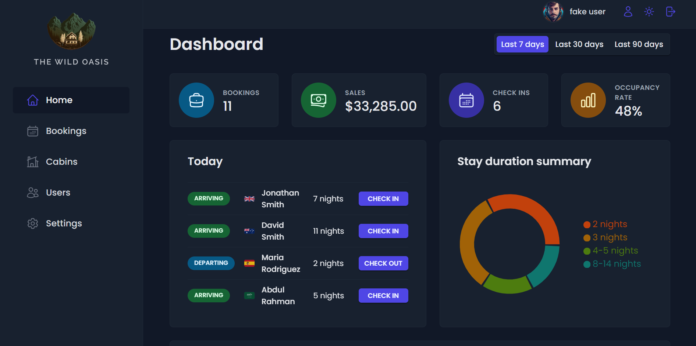

# The Wild Oasis 🌴

Welcome to The Wild Oasis repository! Your destination for everything you need for the perfect getaway! 🏝️

  

## Key Features 🌟

- **Accommodation Booking**: Quick and easy booking of accommodations in the wilderness.
- **React Query**: Efficient data management with the React Query library.
- **Styled Components**: Styling components using Styled Components, providing an attractive and intuitive design.
- **React Hook Form**: Lightweight and efficient form management in React.
- **Supabase**: Using Supabase for authentication and cloud data management.
- **Advanced Compound Component Pattern**: Implementation of advanced compound component pattern for flexible and scalable interaction management.
- **Authentication**: Secure authentication system to protect user data.
- **Charts**: Data visualization using charts for better understanding of statistics and trends.
- **Dark Mode**: Conveniently configured Dark Mode for comfortable app usage in low-light conditions.

## Technologies and Tools Used 🛠️

- **React.js**: Powerful platform for building user interfaces.
- **React Query**: Library for state and data management in React applications.
- **Styled Components**: Library for creating reactive styles in React applications.
- **React Hook Form**: Library for easier form management in React.
- **Supabase**: Open platform for building cloud applications.
- **Git version control**: For secure and efficient development process.
- **Visual Studio Code**: Reliable tool for application development.
